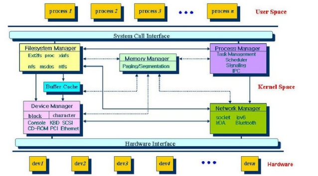

# 1. How OSs work in General

- [1.1 Operating System](#11-operating-system)
- [1.2 Booting](#12-booting)
- [1.3 운영체제 구성요소](#13-운영체제-구성요소)
  - [1.3.1 Kernel](#131-kernel)
  - [1.3.2 Shell](#132-shell)
- [출처](#출처)

## 1.1 Operating System

시스템 자원 관리자

응용 소프트웨어를 실행하기 위한 하드웨어 추상화 플랫폼과 공통 시스템 서비스를 제공하는 '시스템 소프트웨어'

- 자원관리 - 자원을 적절하게 배분
- 자원보호 - 비정상적인 작업으로부터 보호
- 하드웨어 인터페이스
- 사용자 인터페이스

| 용어                       | 해설                                                               |
| -------------------------- | ------------------------------------------------------------------ |
| 처리능력(Throughput)       | 일정 시간 내에 시스템이 처리하는 일의 양                           |
| 반환시간(Turn Around Time) | 시스템에 작업을 의뢰한 시간으로부터 처리가 완료될 때까지 걸린 시간 |
| 사용가능도(Availavility)   | 시스템을 사용할 필요가 있을 때 즉시 사용 가능한 정도               |
| 신뢰도(Realiabilty)        | 시스템이 주어진 문제를 정확하게 해결하는 정도                      |

- 시스템 콜 인터페이스
  - OS 커널에 요청 할 수 있는 통로

## 1.2 Booting

- Boot Loader

  컴퓨터가 켜졌을 때 운영체제에 필요한 조치를 취하고 하드 디스크에 저장되어 있는 운영체제를 실행하는 프로그램

## 1.3 운영체제 구성요소

### 1.3.1 Kernel

OS의 핵심. 하드웨어의 자원을 필요한 프로세스에 나눠줌.

- 프로세스 관리자
- 메모리 관리자
- 파일 시스템
- 네트워크 관리자
- 디바이스 관리자

커널의 분류

- Monolithic kernels
  - 다양한 서비스와 하드웨어 추상화를 하나의 덩어리로 만듬
  - 유지 보수가 어려움.
  - 성능이 좋음.
  - BSD(UNIX), Linux, DOS
- Microkernels
  - 간결한 집합을 제공
  - 다양한 서비스는 서버라는 응용프로그램으로 제공
  - 확장성이 용이함
  - L4 마이크로커널
- Hybrid (or modular) kernels
  - 성능 향상을 위해 커널 공간에 서비스를 추가
  - NT(windows), XNU(macOS)

### 1.3.2 Shell

사용자가 화면에서 볼 수 있는 요소. 사용자의 지시를 해석해 커널에 전달

- 리눅스 : Bash, GNOME, KDE
- 윈도우 : cmd, explorer

---

## 출처

- 운영체제 <https://ko.wikipedia.org/wiki/%EC%9A%B4%EC%98%81_%EC%B2%B4%EC%A0%9C>
- 운영체제 <https://namu.wiki/w/%EC%9A%B4%EC%98%81%EC%B2%B4%EC%A0%9C>
- 리눅스의 구조와 특징 <https://m.blog.naver.com/PostView.naver?isHttpsRedirect=true&blogId=scw0531&logNo=220611837266>
- 리눅스 커널 구조 <https://mintnlatte.tistory.com/393>
