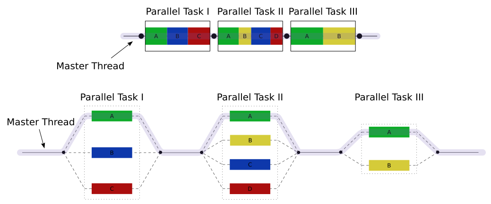

# 3. Threads and Concurrency

- [3.1 스레드(Thread)](#31-스레드thread)
  - [스레드의 종류](#스레드의-종류)
  - [스레딩 모델](#스레딩-모델)
  - [멀티 프로세스와 멀티 스레드](#멀티-프로세스와-멀티-스레드)
  - [Thread library](#thread-library)
  - [Implicit Threading](#implicit-threading)
    - [Thread pools](#thread-pools)
    - [Fork–join_model](#forkjoin_model)
    - [OpenMP](#openmp)
    - [Grand Central Dispatch](#grand-central-dispatch)
- [3.2 Concurrency(병행성, 동시성)](#32-concurrency병행성-동시성)
  - [Deadlock](#deadlock)
  - [Starvation](#starvation)
- [출처](#출처)

## 3.1 스레드(Thread)

프로세스에서 실행 되는 여러 흐름의 단위


- Stack만 따로 할당
- 프로세스 내의 주소 공간이나 자원(힙 등)을 공유하며 실행
- 한 스레드가 프로세스 자원을 변경하면, 다른 이웃 스레드도 변경 즉시 결과를 알 수 있음.

### 스레드의 종류

- 사용자 레벨 스레드 (User-Level Thread)

  - 사용자 영역에서 지원, 커널은 알 수 없음.
  - 사용자 레벨의 라이브러리를 통해 구현
  - 라이브러리가 스레드의 생성 및 스케줄링 등에 관한 관리 기능을 제공
  - 장점 - 동일한 메모리 영역에서 스레드가 생성 및 관리되므로 속도가 빠름(커널의 개입이 없음).
  - 단점 - 하나의 스레드가 시스템 호출 등으로 중단되면 나머지 모든 스레드 역시 중단(프로세스가 block되므로)
    - 해결 - non-block I/O를 이용해 쓰레드를 block하는 I/O API를 라이브러리가 제공해야 함.
    - 비동기로 프로그램을 작성.

- 커널 레벨 스레드 (Kernel-Level Thread)
  - 운영체제가 지원하는 스레드 기능으로 구현
  - 커널이 스레드의 생성 및 스케줄링 등을 관리
  - 스레드가 시스템 호출 등으로 중단되더라도, 커널은 프로세스 내의 다른 스레드를 중단시키지 않고 계속 실행
  - 시스템의 각 논리적 코어에 하나의 스레드를 할당할 수 있음.

Java 스레드

- JVM이 운영체제의 역할
- 프로세스가 존재하지 않고, 스레드만 존재
- JVM에 의해 스케줄 되는 실행 단위 코드 블록
- JVM이 관리하는 정보
  - 스레드 갯수
  - 스레드로 실행되는 코드의 메모리 위치
  - 스레드의 상태
  - 스레드 우선순위

### 스레딩 모델

- 1:1(Kernel-Level Thread)
  - 가장 높은 concurrency 제공.
  - 너무 많은 thread를 만들지 않게 주의.
  - Linux, Windows에서 제공
- N:1(User-Level Thread)
  - 다중 처리 코어를 활용 불가.
  - green-thread - 옛날 JVM
- M:N(hybrid threading)
  - 다수의 user-level 스레드를 그 이하의 갯수의 kernel 스레드에 할당
  - N:1보단 더 높은 concurrency 제공.

### 멀티 프로세스와 멀티 스레드

| 구분                  | 멀티 프로세스                                        | 멀티 스레드                                                                 |
| --------------------- | ---------------------------------------------------- | --------------------------------------------------------------------------- |
| 용어                  | 여러 프로세스로 구성하여 각 프로세스가 작업을 처리   | 여러개의 스레드로 구성하고 각 스레드가 작업을 처리                          |
| 메모리 공간           | 독립적 공간                                          | 프로세스 자원 공유, 단 stack은 독립                                         |
| Context Switching     | 오버헤드(캐시 메모리 초기화)가 큼.                   | 캐쉬 초기화 필요 없음.                                                      |
| 안정성                | 자식 프로세스에 문제가 발생하면 자식 프로세스만 죽음 | 한 스레드에 문제가 발생하면 전체 스레드가 종료                              |
| 메모리 공간, CPU 사용 | 많음                                                 | 적음                                                                        |
| 통신                  | IPC를 통해서 해야함                                  | 공유(Stack 제외)                                                            |
| 기타                  |                                                      | 디버깅이 어려움. 다른 프로세스의 스레드는 제어 불가. 동기화 문제(데드락 등) |

- 멀티쓰레드의 장점
  - Responsiveness - 별도의 쓰레드가 사용자에게 반응 할 수 있음.
  - Resource sharing - 속한 프로세스의 메모리와 리소스를 공유.
  - Economy - 프로세스를 생성하여 메모리 및 리소스 할당하는 것보다 저렴.
  - Scalability - 멀티프로세서에 의해 병렬적으로 동작하게 확장.

### Thread library


- Pthreads - POSIX 스팩, UNIX타입의 OS들이 사용. LInux, Mac Os, Solaris
- Windows Threads
- Java Threads - 호스트 운영체제의 커널 스레드에 맵핑.
  (?? Threads와 runable의 차이? 상속과 구현 뿐인가?)

### Implicit Threading

- 스레드의 생성과 관리 책임을 개발자가 하지 않음.
- 컴파일러와 런타임 라이브러리가 스레딩
- 개발자는 병렬로 실행할 수 있는 작업만 식별하여 작업을 함수로 작성

#### Thread pools


- 스레드를 미리 만들어 놓고, 들어오는 task에 따라 할당 하는 것.
- 스레드 생성/수거에 드는 비용 절감
- 스레드 수를 적당하게 설정 할 수 있음.

#### Fork–join_model



- 병렬 작업을 할당 하면 적당히 (재귀적으로) 일을 쪼

#### OpenMP

- 공유 메모리 다중 처리 프로그래밍 API
- C, C++, 포트란 지원
- 병렬 블록(parallel regions)을 지정
- 코어의 갯수 만큼 쓰레드 생성.
- 컴파일러가 지원 해줘야 함.

```cpp
#include <omp.h>
#include <stdio.h>
int main(int argc, char *argv[])
{
  // ...
  /* sequential code */
  #pragma omp parallel
  {
    printf("I am a parallel region.");
  }

  #pragma omp parallel for
  for (i = 0; i < N; i++) {
    c[i] = a[i] + b[i];
  }
  /* sequential code */
  return 0;
}
```

#### Grand Central Dispatch

- Mac OS
- 블록 단위로 관리
- 시스템이 관리하는 스레드 풀에서 실행
- dispatch queue(FIFO) 큐에 등록
  - serial queue - Main큐, 연속적으로 실행 해야하는 것
  - concurrent queue - 병렬로 실행하는 것

```cpp
^{ printf("I am a block"); }
```

## 3.2 Concurrency(병행성, 동시성)

- 여러 작업을 한 번에 수행하는 시스템의 특성
- (멀티프로그래밍과 차이점은?)
- 장점 - 응답 시간 최소화, 처리량 최대화
- 단점 - 부정확할 수 있음. 원인 - 교착 상태(deadlock), 기아 상태(starvation)

  

- Concurrency(병행성) - 각 cpu의 스케줄
- Parallelism(병렬) - 두 cpu는 Parallel하게 동작

### Deadlock

- 두개 이상의 작업이 서로 상대방의 작업이 끝나길 기다리고 있어 아무것도 완료되지 못하는 상태

### Starvation

- 프로세스가 끊임없이 자원을 가져오지 못하는 상황.
- 스케줄링 알고리즘에서 많이 발생.

---

## 출처

- [OS] concurrency and thread <https://velog.io/@ssseungzz7/OS-concurrency-and-thread>
- Concurrency (computer science) <https://en.wikipedia.org/wiki/Concurrency_(computer_science)>
- Green threads <https://en.wikipedia.org/wiki/Green_threads>
- Green Thread vs Native Thread <https://perfectacle.github.io/2019/03/10/green-thread-vs-native-thread/>
- Thread Pools in NGINX Boost Performance 9x! <https://www.nginx.com/blog/thread-pools-boost-performance-9x/>
- Thread Pool 이해하기 <https://heowc.dev/2018/02/08/thread-pool/>
- [Java] Thread Pool(스레드 풀) <https://limkydev.tistory.com/55>
- Implicit Threading (암묵적 스레딩) <https://velog.io/@lcy960729/Implicit-Threading-%EC%95%94%EB%AC%B5%EC%A0%81-%EC%8A%A4%EB%A0%88%EB%94%A9>
