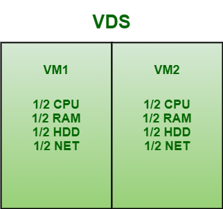

# Internet

## 1. How does the internet work?  
- 인터넷이란? TCP/IP를 통한 전세계적인 컴퓨터 네트워크 
기본적인 인터넷 구성  
컴퓨터 - 라우터 - 모뎀 - ISP(Internet Service Provider) - 모뎀 - 라우터 - 컴퓨터  
라우터란? 컴퓨터 간의 통신을 제공해주는 중계기  
모뎀이란? 디지털신호와 아날로그 신호를 변환해주는 장치  

- TCP/IP란?  
패킷 통신 방식의 인터넷 프로토콜 IP와 전송 조절 프로토콜 TCP.  
IP는 패킷 전달 여부를 보증하지 않음.  
TCP는 IP위에서 데이터 전달을 보증하고 순서대로 받게 해줌.

- OSI 7계층?  

    |OSI7|인터넷|대표 프로토콜|
    |:---:|:---:|---|
    |응용|응용|HTTP, DNS, SMTP|
    |표현|''|SMB|
    |세션|''|TLS, SSL|
    |전송|전송|TCP, UDP, RTP|
    |네트워크|인터넷|IP|
    |데이터 링크|네트워크 엑세스|이더넷, Wi-Fi|
    |물리|''|전선, 광섬유, 동축케이블|

## 2. What is HTTP?  
- HyperText Transfer Protocol      
    하이퍼텍스트를 전송하기 위해 클라이언트와 서버 사이에 이루어 지는 요청/응답 프로토콜  
        - 하이퍼텍스트란? 한 페이지씩 순차적으로 넘겨 보는 문자열이 아니라 링크를 통해 건너 뛸 수 있는 문자열. 대표적으로 HTML이 있음.  

    클라언트는 HTTP request를 서버로 보내고 서버는 HTTP response를 보낸다.  
    HTTP는 상태를 저장하지 않기 때문에 각 요청간의 상관 관계를 표현 할 수 없다.  
    그래서 cookie와 session을 통해 상태를 유지한다.  

    - Requsest  
    클라이언트가 서버에 요구하는 것  
    GET : 자료의 조회를 요청. 서버의 자료를 조회, 요청 파라미터만 전달  
    POST : 자료의 생성/수정을 요청. 요청 파라미터에 바디(내용)까지 전달  
    PUT : 자료의 수정을 요청.  
    DELETE : 자료의 삭제를 요청.  

    - Response  
    서버가 클라이언트의 요청에 응답하는 것  
    Status code : 세자리 숫자로 된 상태코드  
    1xx(조건부 응답) : 요청을 받았으며 작업을 계속함.  
    2xx(성공) : 클라이언트의 요청을 승낙하여 성공적으로 처리함. 200 성공  
    3xx(리다이렉션 완료) : 클라이언트는 요청을 마치기 위해 추가 동작을 해야함.  
    4xx(요청 오류) : 클라이언트의 요청에 오류가 있음. 404 페이지를 찾을 수 없음.  
    5xx(서버 오류) : 서버가 유요한 요청을 수행하지 못했음.   

- cookie와 session
    - cookie  
    웹사이트 방문시 서버를 통해 사용자의 컴퓨터에 설치되는 작은 기록 정보 파일  
    - session  
    쿠키에 기반한 서버에 저장되는 파일  
    클라이언트 구분을 위해 세션ID를 부여하며 브라우저가 종료 될 때까지 인증 상태를 유지  

    |종류|저장위치|보안성|사용 예|
    |---|---|---|---|
    |쿠키|사용자 컴퓨터|낮음|자동로그인정보, 팝업창 다시보지 않기|
    |세션|서버|높음|로그인 상태|

## 3. Browsers and How they work?  
- 브라우저의 주요기능은 사용자의 요청을 서버에 전달하고 응답을 표시하는 것  
웹표준화 기구인 W3C에서 정해진대로 CSS 명세에 따라 HTML을 해석하여 표시함.  
구조  

      

    - 사용자 인터페이스 : 주소표시줄, 이전/다음, 새로고침, 북마크 등  
    - 브라우저 엔진 : 브라우저의 핵심. 브라우저의 동작을 담당  
    - 렌더링 엔진 : 요청한 콘덴츠를 표시, HTML과 CSS를 파싱하여 출력  
    - 통신 : HTTP 요청과 같은 네트워크 호출에 사용됨.  
    - 자바스크립트 해석기 : 자바스크립트 코드를 해석하고 실행  
    - UI 백엔드 : 콤보박스와 창 같은 기본적인 장치를 그림, 일반적 인터페이스로 OS UI를 사용  
    - 자료 저장소 : 자료를 저장하는 계층, 쿠키등 모든 종류의 자원을 하드 디스크에 저장  

## 4. DNS and How it works?  
 - Domain Name System  
호스트의 도메인 이름을 호스트의 네트워크 주소로 바꾸거나 그 반대의 변환을 수행  

      

    - DNS 리커서 : 웹 브라우저 등의 애플리케이션을 통해 클라이언트 컴퓨터로부터 쿼리를 받는 서버. 도서관 사서  
    - 루트 이름 서버 : 다른 더욱 특정한 위치에 대한 참조. 도서관 책장 분류 색인  
    - TLD(Top-Level Domain) 이름 서버 : 호스트 이름의 마지막 부분을 호스팅(comic.naver.com의 com서버). 도서관의 책장  
    - 권한 있는 이름 서버 : 최종 이름 서버. 권한 있느 이름 서버가 요청한 레코드에 대한 엑세스 권한이 있다면, 요청한 호스트 이름의 IP주소를 DNS 리커서에게 돌려 보냄. 책장의 사전  

## 5. What is Domain Name?  
- 인터넷에 연결된 컴퓨터를 사람이 쉽게 기억하고 입력할 수 있또록 문자로 만든 주소.  
도메인 레지스트리에게서 등록된 이름.  

      
    - 일반최상위도메인 : 국제 인터넷 주소자원 관리기관(ICANN)이 관리. .com, .org, .net 등이 있고, 대부분 국가와 관계 없이 등록 가능  
    - 국가코드최상위도메인 : 각국의 NIC에서 관리하는 국가별 도메인. .kr, .jp .cn  

## 6. What is hosting  
서버 컴퓨터의 전체 또는 일부분을 이용할 수 있도록 임대해주는 서비스  
웹 호스팅, 서버 호스팅, 메일 호스팅등이 있음.  
e.g. AWS(Amazon Web Services), Cloudflare, GitHub, Microsoft Azure

- 공유 웹 호스팅(Shared web hosting)  
여러 개의 사이트가 한 서버를 공유해 운영  
오버셀링(서버 용량을 넘어선 판매)에 취약함
여러 사이트에 사람이 동시 몰리면 서버의 부담이 큼
    - Reseller web hosting  
호스팅 서비스를 구매해 다른 사람에게 재판매 하는 것. 계정을 구매해 하위 계정을 만듬.

- 메일 호스팅(Email Hosting)  
메일 도메인을 직접 구매하여 메일 서버에 연결하여 운영  
e.g. Google Workspace

- 서버 호스팅(Server hosting)  
    
    - 가상 사설 서버(Virtual Private Server)  
    가상 서버의 공유 코어 CPU를 할당 받음  
      
    - 가상 전용 서버(Virtural Decicated Server)  
    가상 서버의 전용 코어 CPU를 할당 받음  
    - 전용 서버 호스팅(Decicated Hosting service)  
    한대의 서버를 통째로 할당
    e.g. AWS metal  
    - 코로케이션(colocation web hosting service)  
    서버를 구매해 IDC(Internet Data Center)에 입주시켜 운영하는 것

- Cloud hosting  
    - Clustered hosting  
    동일한 콘덴츠를 호스팅 하는 여러 서버가 존재
        - 클러스터? 여러 대의 컴퓨터들이 연결되어 하나의 시스템처럼 동작하는 컴퓨터 집합
    - Grid hosting
    클러스터가 그리드 처럼 작동하는 서버
        - 그리드? 원거리 통신망으로 연결된 서로 다른 기종의 컴퓨터를 하나로 묶어 가상의 고성능 컴퓨터를 구성

---
## 출처  
인터넷 작동원리 [https://data-make.tistory.com/665](https://data-make.tistory.com/665)  
인터넷은 어떻게 동작하는가? [https://developer.mozilla.org/ko/docs/Learn/Common_questions/How_does_the_Internet_work](https://developer.mozilla.org/ko/docs/Learn/Common_questions/How_does_the_Internet_work)  
HTTP란 무엇인가? [https://velog.io/@surim014/HTTP란-무엇인가](https://velog.io/@surim014/HTTP%EB%9E%80-%EB%AC%B4%EC%97%87%EC%9D%B8%EA%B0%80)  
브라우저는 어떻게 동작하는가? [https://d2.naver.com/helloworld/59361](https://d2.naver.com/helloworld/59361)  
DNS란 무엇입니까? [https://www.cloudflare.com/ko-kr/learning/dns/what-is-dns/](https://www.cloudflare.com/ko-kr/learning/dns/what-is-dns/)  
도메인이란? [https://한국인터넷정보센터.한국/jsp/resources/domainInfo/domainInfo.jsp](https://xn--3e0bx5euxnjje69i70af08bea817g.xn--3e0b707e/jsp/resources/domainInfo/domainInfo.jsp)  
호스팅 [https://namu.wiki/w/호스팅](https://namu.wiki/w/%ED%98%B8%EC%8A%A4%ED%8C%85) 
Web hosting service https://en.wikipedia.org/wiki/Web_hosting_service  
Difference between VPS and VDS https://www.geeksforgeeks.org/difference-between-vps-and-vds/
